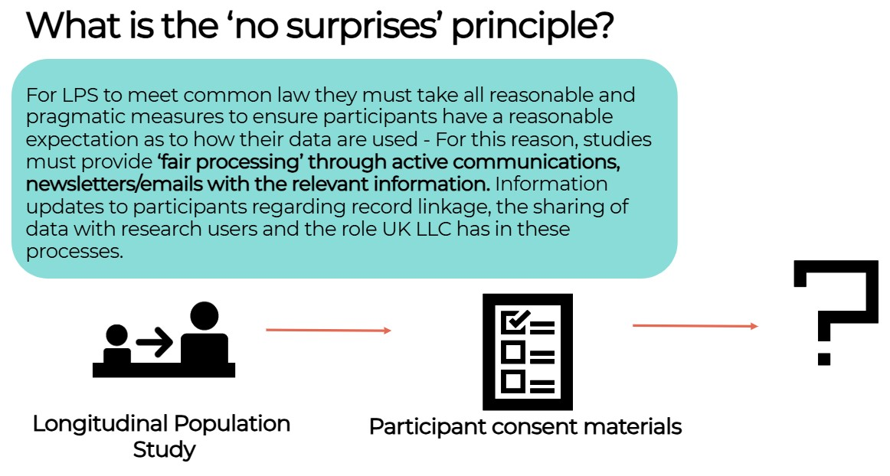
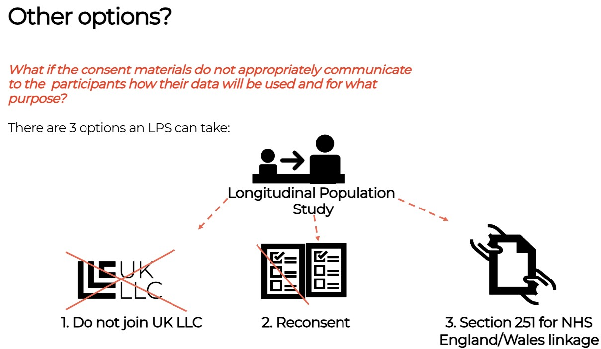
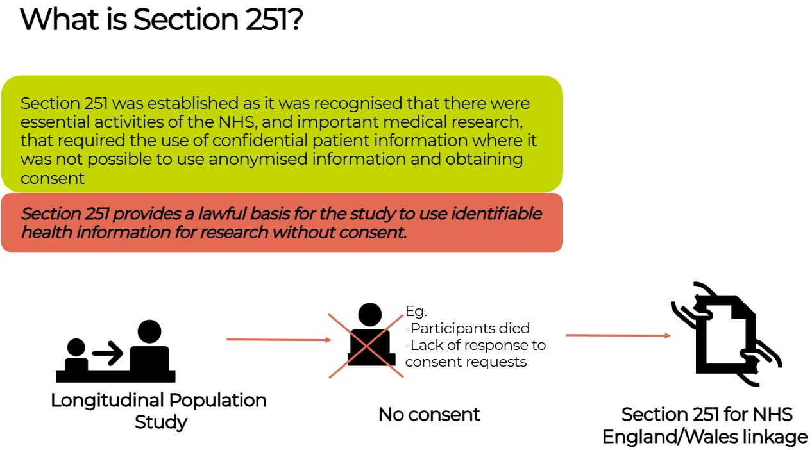

### Background information
> Last modified: 07 May 2025

This section provides background information to aid understanding of legal basis and outlines how to meet Common Law Duty of Confidentiality.

##### What are the requirements to meet Common Law Duty of Confidentiality? 
LPS must establish a legal basis for addressing Duty of Confidentiality. 

  <strong>Common Law Duty of Confidentiality</strong> are the expectations resulting from the UK’s cumulative case law relating to the handling of individuals' confidential data.

 
This is most likely to be either consent or a legal mechanism to set aside the requirement to address this duty. LPS must take all reasonable measures to ensure participants have a ‘reasonable expectation’ as to how their data are used – known as ‘no surprises’ principle. 

Common Law Duty of Confidentiality (which has the same status as statute law) applies when a person provides an LPS with information in the expectation that it will be treated in confidence. For an LPS to process Personal Data it is therefore the case that they must make ‘best endeavours’ to set a ‘reasonable expectation’ about this processing. To demonstrate compliance with Common Law Duty of Confidentiality LPS must either:
 i) collect consent
ii) implement a mechanism to set aside Common Law Duty of Confidentiality requirements (such as Section 251 support to use NHS records without consent)
iii) establish a reasonable expectation or ensure the data are Anonymous. 
The approach to this varies across the UK as Section 251 only applies in England and Wales and only applies to NHS records (not LPS data). In practice consent is the preferred mechanism however attempts to collect this retrospectively are likely to result in partial response where likelihood of responding is patterned by health and social characteristics. 

##### Consent 

UK LPS are often called the 'consented studies', but the role of consent in these studies is complicated. All LPS participants are volunteers who have chosen to join the LPS, and all have the right to withdraw whenever they want. In this sense all participation is 'consented' in that it is based on an active and informed relationship. LPS may also seek consent for specific aspects of activity in the LPS, such as using genetic information or linking to health records. However, as LPS can run over decades, it is hard to keep consent up to date and reflecting changes in technology, best practice and new ways of working, such as UK LLC. This means for LPS 'consent' is difficult to manage.  

From a legal perspective, consent is: 

* NOT the basis by which LPS comply with UK GDPR and data protection law - scientific research is a permitted purpose in its own right; and 

* is OFTEN the basis by which the Common Law Duty of Confidentiality is met. In common law, information given under an expectation of privacy (e.g. information from a patient to their doctor), should stay private unless permission to share it is in place. 

Seeking consent is often not possible or leads to partial response where likelihood of responding is patterned by health and social characteristics and therefore biases research or excludes some harder to reach communities such as children in the care system, or those in temporary accommodation. 

Sometimes seeking consent is not possible, if the person has died or no longer has capacity to make a choice (e.g. someone with dementia). For this reason, there are laws which make it possible to use data without breaching common law. These laws were used during the coronavirus pandemic but also exist in general to help ensure research is fair and inclusive. For the use of NHS data in England, this law is called Section 251. 

##### Section 251 
Section 251 provides a lawful basis for an LPS to use identifiable health information for research without consent (e.g. where all the participants in an LPS have died or where lack of response to consent requests will likely bias the research and lead to research inequity and harms). Section 251 only applies in England and Wales. 

 LPS can apply to HRA CAG for Section251 Support which allows Common Law duties to be set aside. They can recommend that an LPS can utilise Section 251 where consent is not practicable and frequently on the condition that:  

* LPS contact their own Patient and Public Involvement and Engagement (PPIE) activity to understand and accommodate participant expectations.  

* LPS do all that is practical to contact participants, providing fair processing information about the data use and a means to opt-out.  

* LPS send regular updates about how health records are used and remind participants how to opt-out.  

* ‘NHS National Data Opt Outs’ are honoured – this is a national scheme in England which allows members of the public to stop their data being used for research unless consent is in place. 

##### Utilising the Digital Economy Act (DEA): 

The DEA provides a means to meet Duty of Confidentiality for the use of non-health routine records in public good research. To use the DEA the UK LLC must be accredited to UK Statistic Authority standards for a secure data processing environment. The DEA applies across the UK but does not apply to health data. The DEA will provide the legal basis for Duty of Confidentiality but LPS participating in non-health linkages via UK LLC will still need to meet their ethical requirements to ensure transparent data use and ‘no surprises’ and provide a means to object. Consent may be used as part of meeting the study's ethical requirements. 

##### UK General Data Protection (GDPR) Regulations 

Most LPS process identifiable data given that they hold participant contact databases and administer processes which require the use of identifiers (mailing information and data collection exercises, conducting fieldwork or study assessments, linking to participant records).  LPS therefore manage Personal Data (broadly, the legal term for identifiable data) and therefore UK General Data Protection Regulations (UK GDPR) and Common Law Duty of Confidentiality apply. 

There is clear guidance and a broad consensus that LPS should not be using consent as a means to process participant Personal Data. Rather, LPS should make use of alternative legal basis within the regulations: 

1. Performance of a task carried out in the public interest (Article 6(1)(e) in the GDPR), and, where sensitive personal information is involved: 

2. Scientific or historical research purposes or statistical purposes (Article 9(2)(j) in accordance with Article 89(1)). Most LPS pseudonymise their data to remove identifiers and replace these with an ID number. Where pseudonymous data cn be linked back to the identifiers pseudonymous data, it is still Personal Data. 

UK GDPR makes a distinction between data and sensitive data: all health data are considered sensitive as are other classes of information including many demographic characteristics. The processing of these will need additional safeguards. 

UK GDPR sets out a series of rights for individuals. For research, there are derogations in place which mean that not all UK GDPR rights need to be applied. 

##### UK LLC Confidentiality Due Diligence Panel 

UK LLC has worked with NHS England’s Advisory Group for Data (AGD) to formalise a consistent review process.   As part of the review framework, UK LLC has set up a Confidentiality Due Diligence Panel consisting of experts in Data Protection, Research Governance and public contributors. The Panel advises on whether new partnering LPS have established a basis for addressing their Common Law Duty of Confidentiality appropriately and ensured compliance with the principle of ‘no surprises'. For each LPS application the Panel is required to review the LPS consent materials (consent forms and participant information sheets). 

 

> [FAQs](https://ukllc.ac.uk/faq) about UK LLC 
