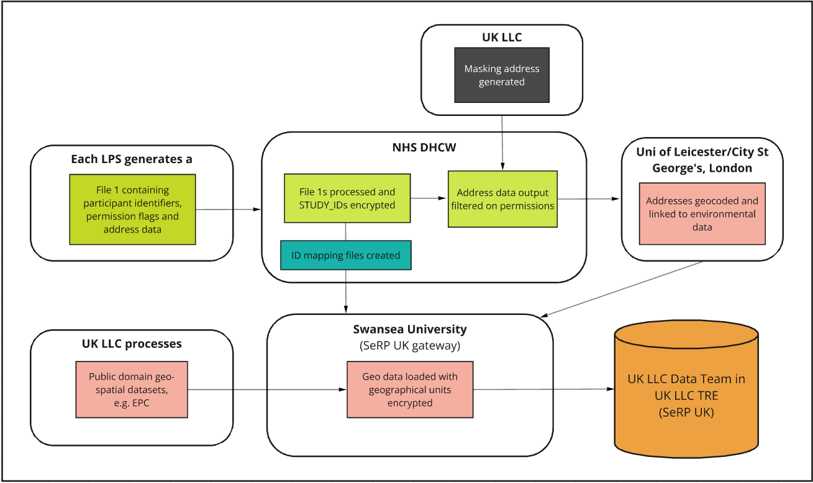

# Partnering with UK LLC 

>Last modified: 14 Apr 2025

This section provides information about partnering with UK LLC including, data flow diagrams and advice relating to the design of consent materials.

# Data flow diagrams

**Figure1:** Overview of data flow from Data Owner National Health Service (NHS).

**Figure 2:** Overview of data flow from address or postcode to Geospatial 
data

**Figure 3:** Overview of indicative dataflow of ONS held datasets (Data 
owners: Department for Work and Pensions (DWP), HM Revenue 
and Customs (HMRC) and Department for Education (DfE))

> [FAQs](https://ukllc.ac.uk/faq) about UK LLC

