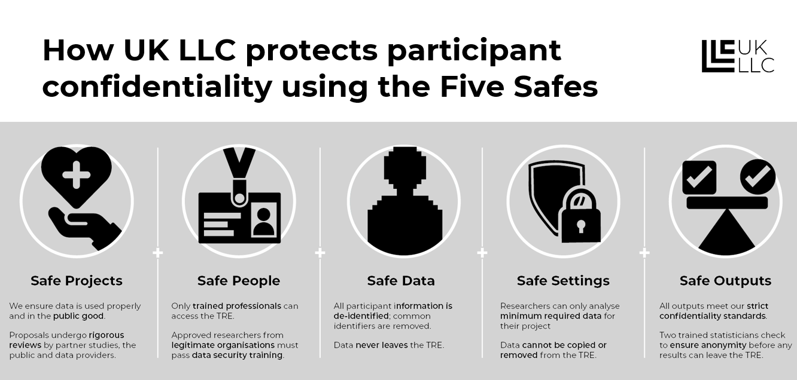

# Good practice, Myths & Misconceptions
>Last modified: 15 Sep 2026

This section covers our examples of good practice developed by partner studies and by UK LLC with our public/participant contributors. It also seeks to address common myths & misconceptions to consider when developing communication materials. This section also describes what “fair processing” is, why you need to conduct it, and the different approaches to designing fair processing communication methods.  This page is intended for communications teams at LPS’ that are onboarding with UK LLC to ensure their participant materials are clear as to how they will work with UK LLC. 

To understand the legal and ethical background to fair processing please see our [background information](https://resourcehub.ukllc.ac.uk/consent%20and%20legal%20basis) page.

<aside class="admonition danger">
Warning
Some studies have been asked to delete the personal identifiers of their participants by various organisations. Whilst in some cases this may be appropriate, it is an extreme and non-reversable decision which severely limits future options and better options likely exist. We recommend you get in touch if ever asked to delete your participant identifiers.</aside>    

#### Good practice when developing active communication materials

Many longitudinal studies have developed a deep understanding of consenting and communication with their participants. As each study sample and history is different, we know there is no “right” language, tone or approach to take. Each study will be best placed to understand how to communicate with their participants. However, there are common requirements (must do’s) and common pitfalls some studies have fallen into over time.

Consent statements and fair processing materials should be carefully phrased, taking into account literature on consenting behaviours and avoiding imposing unintentional limitations on data use. We all strive to future proof the wording used, but this is always challenging. Consent phrasing should make clear the understanding and agreement on the high-level principles involved, whereas information materials can provide detail and exemplar illustrations.

<aside class="admonition danger">
If you are a UK LPS designing a consent or re-consenting campaign
Please get in touch with UK LLC using <a href="mailto: info@ukllc.ac.uk">info@ukllc.ac.uk</a> we can share our current understanding of best practice.</aside> 
 

Expectations of good practice in consent will change over time. Therefore, any development process should start with evaluating guidance and academic literature and then consulting with domain experts, data owners and LPS participants. The co-design of materials with participants and members of the public is a critical element of the process. 

There is a significant amount of supporting documentation you will need to have in place, some of which may already be in place, although it may need to be updated to reflect the new sources of data. This will include an LPS protocol, [HRA protocol](https://www.hra.nhs.uk/planning-and-improving-research/research-planning/protocol/), an LPS privacy notice, a data asset register and a data flow diagram. 

#### Fair Processing Principles

UK LLC consider the following key principles underpin effective fair processing:
* The materials must be clear and accessible – informed consent relies on everyone being able to understand the information.
* Active communications are essential (i.e. information sent directly to participants via electronic or physical means), but passive materials play important supporting roles.
* Fair processing is an ongoing process, not a point in time, reminders about rights and how data are used should be included in regular updates (e.g. newsletters).
* In our experience participants care more about high level principles (e.g. that data are not physically shared but are accessed in a secure environment) than details (e.g. that data are stored on X system at X building).
* Being overly specific can result in consent and fair processing becoming dated and can be a barrier to emerging longitudinal opportunities. Too much detail or restrictive statements is the root cause of many problems faced by different studies.
* That fair processing should be provided in “layers” of detail, where most participants want summary information but we need to recognise that some participants are domain experts (e.g. in IT security or professors of epidemiology) and want to know the detail. Layered and focused materials provide the depth for those who want it.
* It is crucial to involve your participants in the design of your materials.

  

    

    <strong>Key messages that MUST be included in LPS active communications when joining UK LLC</strong>
    

  
 

| Concept                      | Principle to Convey (top layer)                                                                 | Potential Supporting Narrative                                                                                                                                                                                                                     |
|------------------------------|------------------------------------------------------------------------------------------------|-----------------------------------------------------------------------------------------------------------------------------------------------------------------------------------------------------------------------------------------------------|
| Research Purpose             | Scope of research  (for information, UK LLC can support any public good research).     | • That UK LLC supports research for public good.   • That the LPS retain control over which participants’ records are used, who can use the data, and for which purpose.                                                                 |
| Record Linkage               | (1) Participants’ health, administrative (e.g. HMRC/DWP/DfE), and environmental records are linked to LPS survey data.   (2) Participant identifiers are shared with the NHS and UK Statistical Authorities to achieve this purpose.   (3) Participant address data are geo-coded to enable place-based data linkage. | • UK LLC is a mechanism by which the LPS implements its record linkage strategy.   • UK LLC provides a centralised mechanism which provides added security, is cost-efficient, and enables new scientific possibilities and improved research equity.   • Participants’ identifiers are only shared with the same NHS and Statistical Authorities that the LPS would use directly.   • All data in the UK LLC is de-identified and subject to [Five Safe’s framework](https://ukdataservice.ac.uk/help/secure-lab/what-is-the-five-safes-framework/).   • The data stay in the UK LLC Trusted Research Environment at all times and only anonymous findings can leave the UK LLC environment. |
| Researchers accessing data   | That (accredited) researchers beyond the study team will access data (within the TRE).                 | • The LPS retains control over which participants’ records are used, who can use the data, and for which purpose.   • UK LLC provides a secure mechanism for the LPS to share de-identified data with approved researchers under contract and subject to controlled and audited conditions.   • Over time access to UK LLC is likely to extend internationally and to commercial users, always subject to the same safeguards.  |
| Retention period   | It is clear to participants how long their data will be retained even if this is indefinitely.                 | • How long the LPS intends to retain participants data for.   • UK LLC retains participant data in line with what participants have consented to.   • Additional fair processing can provide further detail on how the retention period is reviewed or if ongoing retention is assessed in line with scientific utility.  |
| Right to Object              | Participants are free to change their minds and object to data being shared with UK LLC (or more generally). | • The right to object is always respected, and a mechanism exists to stop the record linkage process and all new use of participants’ data.   • For Section 251 LPS studies, UK LLC respects the National Data Opt-Out and no data is linked where participants have set a National Data Opt-Out request. |
| Types of data to be linked to | Linkage to data type(s): health records, administrative data [relevant examples as appropriate]. | • This could include…..   • Such as……   [Avoid detailing exhaustive lists of data types, as this can become problematic as it may exclude data types in the future.] We recommend making clear both physical and mental health records are accessed but not going into more depth – datasets change over time and “listing” is a frequent barrier to consent.   • Do not name organisations, e.g. NHS England as these change. Rather, use terms such as “NHS authorities who share data for research purposes”, whilst bearing in mind some health records may be shared via private organisations (e.g. private hospitals, opticians).  • Some LPS have not consented for the use of address data for linkage to environmental records. UK LLC recommends studies do consent for this and at a minimum make this clear and provide a clear route to object.
| Duration | Make clear that longitudinal studies are designed to operate over very long time periods, potentially lifetimes. | • That study involvement is ongoing unless people opt-out.  • That use of collected data and linked data will continue even if people lose mental capacity and after death.
                                                                                 
*Include information on environmental data linkage where LPS have a postcode or address sharing permissions in place. 

  

    

    <strong>Health Research Authority (HRA) guidance for Consent and Participant Information Sheets (PIS)</strong>
    

  

*The HRA has general guidance that should be optimised for LPS’s requirements. UK LLC notes that some of the generic guidance has been adopted by longitudinal studies thinking it is a mandatory requirement; e.g. setting a time limitation as to how long data can be retained. This is an area of high risk for studies and has led to substantial issues. While HRA is the regulator for research and sets the rules for much of our sector (i.e. for all studies seeking linkage to NHS records or using NHS services as part of recruitment or fieldwork), their guidance is often for all research types. There is flexibility within the guidance and we recommend studies avoid unnecessary restrictive statements based on generic guidance. The following section seeks to guide studies through some of these issues, although we stress that adherence to laws and regulatory requirements (including both the Information Commissioner’s Office, Health Research Authority and UK Statistics Authority) is mandatory.*

In the summary PIS

The Health Research Authority (HRA) recommend providing potential participants with a summary sheet of a simple outline of the study including a brief and simple explanation of personal data. 

>In this research study we will use information from [you] [your medical records] [your GP] [OTHER]. We will only use information that we need for the research study. We will let very few people know your name or contact details, and only if they really need it for this study. **(UK LLC recommends providing an overview of the types of records and examples rather than an extensive or exclusive list of records to enable linkages that may become available.)**
>
>Everyone involved in this study will keep your data safe and secure. We will also follow all privacy rules. 
>
>At the end of the study we will save some of the data [in case we need to check it] AND/OR [for future research]. 
>
>We will make sure no-one can work out who you are from the reports we write.
>
>The information pack tells you more about this.

In the PIS or document provided to participants:

>How will we use information about you?
>
>We will need to use information from [you] [from your medical records] [your GP] [OTHER] for this research project. **(UK LLC recommends providing an overview of the types of records and examples rather than an extensive or exclusive list of records to enable linkages that may become available. We recommend against referencing specific roles such as a GP in any given context, as gatekeeper roles can move to different organisations.)**
>
>This information will include your [initials/NHS number/name/contact details/ **provide a bullet list of identifiers held by site and/or sponsor for the research**]. People will use this information to do the research or to check your records to make sure that the research is being done properly. (UK LLC recommend any list makes clear this is name, address, date of birth and ID numbers such as NHS ID or National Insurance ID where known – often these IDs are not essential to the record linkage process but can improve its accuracy. For some linkages – e.g. to supermarket loyalty cards – they will likely be essential).
>
>**OPTION where applicable:** People who do not need to know who you are will not be able to see your name or contact details. Your data will have a code number instead.
>
>**OPTION if not already stated: [insert name of sponsor]** is the sponsor of this research. *(A sponsor is the organisation or partnership that takes on overall responsibility for arrangements being in place to set up, run and report a research project. It is typically the University or Organisation that runs the study).*
>
>**[insert name of sponsor]** is responsible for looking after your information. We will share your information related to this research project with the following types of organisations:
> - **[in bullet points, list the organisation types]**
> We will keep all information about you safe and secure by:
>**in bullet points, concisely list some of the steps you will take to keep information secure.**

How will we use information about you after the study ends?

(UK LLC cautions against specifying an “end” for a longitudinal study, as timeframes are often extended or studies reactivated after being dormant. Further to this, existing data – including linked records will likely be used after death and for the indefinite future.)
>
>Once we have finished the study, we will keep some of the data so we can check the results. We will write our reports in a way that no-one can work out that you took part in the study. (UK LLC recommends never saying you will delete the names and addresses of participants, while this is frequently recommended in generic guidance this can be a major barrier for ongoing linkage and the recontact of participants for future waves of follow-up). 
>
>**Option 1 where data is stored for a set number of years:** We will keep your study data for a maximum of [insert number] of years. The study data will then be fully anonymised and securely archived or destroyed. **(UK LLC recommends never stating a specific set number of years as it is frequently not possible to determine the ongoing value or opportunity of the data over the long-term. Whilst Data Protection legislation requires a minimum period, this minimum can be indefinite where justifiable (doi: 10.12688/wellcomeopenres.14796.1). We are not aware of any compelling evidence that set time periods result in improved recruitment rates in longitudinal research or generate trust. We are aware of several studies who promised a set period then had to change this, a process which is complex and threatens trust. We strongly recommend making clear why this type of research operates over very long time periods)**
>
>**Option 2 where conditions determine how long data is stored for:** We will keep your study data for the minimum period of time required by **[state the conditions that will be used to determine this time period].** The study data will then be fully anonymised and securely archived or destroyed. (This HRA guidance is strongly influenced by GDPR/UK Data Protection Law, but is highly generic and does not represent the flexibility present in the law*. UK LLC recommends not specifying how long an LPS will retain participant data but remaining compliant with GDPR by only retaining the data for as long as needed. For example “As a longitudinal study we are designed to research long-term patterns in people’s health, to do this we will keep your data for the very long term as this will allow life-long understanding of health and wellbeing”.)

*As per UK GDPR and Data Protection Act, any personal data must not be kept any longer than is necessary for the purpose for which the personal data are processed. However, the Information Commissioner’s Office (ICO) guidance for research data allows retention indefinitely where justifiable. We note that both the data held by UK LLC and the documents relating to the design, operations and development of UK LLC all constitute ‘research data’ and can therefore be held indefinitely.

What are your choices about how your information is used?

>
>- you can stop being part of the study at any time, without giving a reason, but we will keep information about you that we already have. (UK LLC notes that different studies have different approaches as to whether they destroy the existing data held on participants. In our experience most participants withdraw due to the burden of participation and are content for existing data to continue to be used. However, a minority withdraw and strongly feel their data should be destroyed. Our view is this is an ethical decision rather than a legal one as Data Protection law offers exemptions from the need to destroy research data. UK LLC standard practice is to stop all future linkages and future use of linked data for withdrawing participants, but not to destroy data we already hold and which is linked to ongoing and past research studies).
>- **OPTION if follow up data will be collected after withdrawal:** If you choose to stop taking part in the study, we would like to continue collecting information about your health from [central NHS records/your hospital/your GP]. If you do not want this to happen, tell us and we will stop - you have the right to ask us to access, remove, change or delete data we hold about you for the purposes of the study. You can also object to our processing of your data. We might not always be able to do this if it means we cannot use your data to do the research. If so, we will tell you why we cannot do this  
>- **OPTION if data will be used for future research:** If you agree to take part in this study, you will have the option to take part in future research using your data saved from this study. **[Insert details of any specific bank/repository]. (As described above, UK LLC note that participants withdraw for a range of reasons but frequently this is linked to the burden of active participation. We recommend offering participants a range of options when they request withdrawal, including withdrawing from active participation and retaining follow-up via linkage and continued use of existing data).**
>
>*For more information visit the [HRA Guidance on GDPR transparency wording](https://www.hra.nhs.uk/planning-and-improving-research/policies-standards-legislation/data-protection-and-information-governance/gdpr-guidance/templates/transparency-wording-for-all-sponsors)*
>

  

    

    <strong>Key messages that MUST be included in LPS active communications if linking to administrative data</strong>
  
 

| Concept                | Principle to Convey (top layer) | Potential Supporting Narrative                                                                                                                                         |
|------------------------|---------------------------------|------------------------------------------------------------------------------------------------------------------------------------------------------------------------|
| Security & Confidentiality | Reassurances that data will remain secure and confidential                   | • Your/participants’ data never leaves the UK LLC Trusted Research Environment.   • Access to the TRE is only given to Office for National Statistics accredited researchers.   • Your de-identified data/information will be linked to records held by the following Government Service Providers [list departments and data types], detail processing pathway.   • HMRC and DWP do not access any participant data – as part of the UK LLC-based research.   • This is not a way in which authorities learn anything new about anyone and will not impact people’s tax or benefits.   • This does not provide a mechanism to access anyone’s bank details. 

UK LLC adhere to the five safes framework.

  

    

    <strong>Other messages that you may want to include in active communications but must be included in privacy notices/web sources and detailed communications</strong>   
  

  
   

| Concept                  | Principle to Convey (Top Layer) | Potential Supporting Narrative                                                                                                                                                                                                                                                                                                                                 |
|--------------------------|---------------------------------|------------------------------------------------------------------------------------------------------------------------------------------------------------------------------------------------------------------------------------------------------------------------------------------------------------------------------------------------------------------|
| LPS’s continued authority | Restricted use to LPS’s remit   | • For each LPS, the use is restricted to the LPS’s remit (e.g., for an LPS who has committed to participants to undertaking cancer research only, then UK LLC can only be used for cancer-related research for that LPS).   • That UK LLC is designed to provide a service to the LPS and that the LPS remains fully in control over which participants’ data are used for what purpose. |
| Confidentiality           | Data sharing and de-identification | • Participants’ identifiers will only be shared with the NHS and UK statistical authorities to link participants’ information to [health OR other/administrative records].   • All data held within the UK LLC is de-identified, this happens by a highly regulated process between government service providers and universities.   • Data always remains in the UK   • UK LLC adhere to the five safes framework. |
| Review process            | Application review panels       | • All applications to access data are reviewed by:   A panel made up of data owners and data experts to ensure legal requirements are met, and   A panel of public contributors, who assess likely public benefits, clarity of lay materials and advice on the need for project-specific PPIE. |
| Researcher accreditation   | Accreditation and security      | • All researchers accessing data are required to be accredited by the UK Statistics Authority (to ensure statistical competence).   • Linked data is held in a secure Trusted Research Environment which meets the highest Information Security Standards ISO27001 and Digital Economy Act Accreditation. The organisation is audited annually to ensure that it continues to meet these standards. |
| UK LLCs commitments       | Key commitments                 | • UK LLC has a set of key commitments which were developed with a diverse range of public contributors, which [UK LLC promises](https://ukllc.ac.uk/safeguards) to abide by.  |
| UK LLCs data processing pathway | Privacy policy and data flow diagrams | • For Health (NHS) data and Administrative data (Government Service Providers) can be found in the [UK LLC privacy policy](https://ukllc.ac.uk/safeguards) | UK Longitudinal Linkage Collaboration](https:ukllc.ac.uk/privacy-policy)  • Data flow diagrams can be found in the Data flow section. |

  

    

    <strong>Restrictive statements to avoid</strong>
    

  
   

| Concept                                    | Example                                                                 | Rationale                                                                                                                                                                                                 |
|--------------------------------------------|-------------------------------------------------------------------------|----------------------------------------------------------------------------------------------------------------------------------------------------------------------------------------------------------|
| Statements that restrict the research purpose | ‘Data will only be used for e.g. understanding cancer, improving mental health’. | • We caution against purpose limitations unless necessary. While an LPS may be initially funded to conduct a single or range of theme (e.g., disease) focused questions, the data typically develop wider utility and public benefit value.   • This potential is amplified by the co-location and integration of studies via UK LLC, which enables pooled analysis across studies, which can improve research potential through developing power for rare exposure/outcomes and improving research equity with improved potential for sub-group analysis.   • Flexibility is also important for cases like the COVID-19 pandemic.|
| Statements that restrict data processing (linkage) or storage | ‘Data will only be stored at University x or data will be processed by University x’. | We recommend using broader statements around the level of oversight and limiting names of locations or processors to updatable privacy notices. |
| Statements that restrict Open and FAIR access | ‘Only researchers at university x will be able to access your data’. | • Most funders now expect Open and FAIR science, maximising the value of data by sharing it with legitimate users under secure conditions. Participants generally accept that research expertise and capacity may lie outside the direct LPS team or institution.   • We appreciate that some studies may choose not to share data with commercial organisations as this can cause mistrust in some populations. Whilst UK LLC is working to enable commercial sharing (as some studies actively want this), we fully respect study-level policy on this point. |
| Statements that restrict the length of the LPS/collaboration | ‘Your data will only be kept for x years’. | Time limitation statements should be avoided since there may be continued scientific/public benefit beyond that date. LPS often continue longer than their initial funding periods, and there’s limited evidence that the public considers these time limits a meaningful safeguard.    |

   

#### Why do you need to conduct fair processing?

LPS must take all reasonable and pragmatic measures to ensure participants have a reasonable expectation of how their data are used - the ‘no surprises’ principle. For this reason, LPS must provide ‘fair processing’ information updates to participants regarding record linkage, the sharing of data with research users, and the role of UK LLC in these processes. 

  <strong>Fair Processing:</strong> processing personal data must always be fair as well as lawful, you should only handle personal data in ways that people would reasonably expect.

 
The Information Commissioner’s Office recommends a layered approach to providing information - e.g. with a high-level summary (e.g. cover letter, infographic) then a detailed summary leaflet and signposting or providing a source of more detail (e.g. privacy notice/web source for participants who want to understand the detail). Key messages should be reinforced over time preferably through annual active communications.

The figure above is an illustrative representation of the multiple layers of  fair processing information and its communication. Collectively, these layers form a Longitudinal Population Study's  fair processing approach and contribute to meeting legal and ethical obligations. Some materials, such as consent forms and Participant Information Sheets (PIS), are created at a specific point in time and reflect the information available when consent was sought. Other materials are more dynamic in nature, these include newsletters, website content and privacy notices. Newsletter, websites and privacy notices  can be updated over time to provide participants with ongoing information about how their data are being used and processed so long as these don’t contradict the original information provided at the time of consent. 

These additional fair processing materials play an important role in providing updates, further explanations and contextual information about research activities and data linkage, while remaining within the scope of the original consent.

The different layers are interconnected and should support one another through clear signposting. For example, consent materials may direct participants to an LPS website where more detailed or regularly updated information is available. Likewise, newsletters, emails and other active communications can signpost participants to privacy notices, websites or other passive resources containing further information. Such signposting helps ensure that participants are aware of, and can access, more detailed and updated information when they wish to do so.

Wider engagement activities can also help increase awareness of fair processing information and direct participants to relevant resources. Depending on the study population, these activities may include social media content, posters in schools or GP surgeries, and media coverage. 

Participant and Public Involvement and Engagement (PPIE) should be viewed as a cross-cutting element that informs all layers of the fair processing approach. Embedding PPIE throughout the process helps ensure that fair processing communications are meaningful, accessible and responsive to participants' information needs.

#### What should your fair processing cover? 

**UK LLC fair processing must make clear:** 

* The scope of the research purpose that LPS data can be used for. Ideally LPS data are used for a range of research purposes (which could extend from including any public good research to being limited to a specific hypothesis or theme of research). 

* A national Trusted Research Environment(s) is used to enable this linkage in a secure manner (named UK Longitudinal Linkage Collaboration) along with the NHS and national statistics agencies whose role it is to provide access to participants’ records for research purposes. 

* Approved research users, beyond your LPS study team, can apply to access de-identified data within the TRE. 

* That participants have the right to opt-out and to provide details/signpost how to do this. 

#### How should I communicate with participants? 
**Method:**  

* Communications should be made through an ‘active campaign’ i.e. sent by Longitudinal Population Studies (LPS) to all participants, this is often achieved through newsletters or letters sent either electronically or mailed out to all participants which must provide a means to object (LPS may choose to seek specific opt-in consent)..  

* The privacy notices are an opportunity to provide very detailed information for participants (and other stakeholders) who wish to understand this level of detail. UK GDPR requires LPS to issue privacy notices providing fair processing. It should be stressed that while all materials and other communications with participants constitute fair processing, there is a separate need to provide a privacy notice. The Information Commissioner's Office (ICO) has produced [guidance](https://ico.org.uk/for-organisations/advice-for-small-organisations/how-to-write-a-privacy-notice-and-what-goes-in-it/) describing what information should be included. Updates can be provided via social media channels and this is particularly effective at alerting participants to change and promoting new research use and outcomes.  

* UK LLC recommend multi-media approaches, as some people prefer image/graphic based information. UK LLC have co-developed multimedia content with public contributors to support this.  

* LPS must consider equality/accessibility when determining whether to use electronic and postal mechanisms and while an electronic-only approach may be suitable in some LPS, for most a choice of physical media (i.e. postal materials) and electronic media should be offered.

* Reasonable adjustments should be made to accommodate participants' specific needs (e.g., large print media or audio versions). 

**Language:**

* You should use the language that is suited to your LPS and your sample. There is no fixed wording however examples can be found under [UK LLC’s templates](https://resourcehub.ukllc.ac.uk/examples%20of%20lps%20communications%20about%20uk%20llc#).

* Existing information should be up to date (e.g. privacy notices), and participant information sheets should reflect any changes. New stories should be added to existing media - e.g. website updates, social media, newsflashes or blogs should be updated where possible to alert participants to changes and to keep ‘consent’ a live topic.

#### Do I need public/participant involvement? 

UK LLC are firm believers in the importance of rigorous and meaningful public/participant involvement and we run a substantial co-development programme. However, we recognise that not all studies are resourced to have a similar programme and therefore a proportion of our activity is geared to providing studies with co-developed materials.

Data Owners and regulators are increasingly   insisting that LPS include participants and public contributors in understanding what is needed to help ensure there are ‘no surprises’ around data use and to co-develop fair processing materials. LPS using Section 251 must involve participants and/or the public – including gaining feedback on the acceptability of the collaboration with UK LLC, whether existing fair processing is sufficient and co-developing new fair processing – to gain/maintain Health Research Authority (HRA)[ Confidentiality Advisory Group (CAG)](https://www.hra.nhs.uk/about-us/committees-and-services/confidentiality-advisory-group/#:~:text=The%20Confidentiality%20Advisory%20Group%20%28CAG%29%20is%20an%20independent,the%20Health%20Research%20Authority%20%28HRA%29%20for%20research%20uses.) approval. 

Where an LPS has gained  approval to use identifiable data without consent under 'Section 251’ provisions and following review by the Health Research Authority’s Confidentiality Advisory Group then it is considered essential (as a requirement of the HRA CAG) that the fair processing materials and communication methods are co-developed by LPS Patient and Public Involvement and Engagement (PPIE) groups. 

If it is not possible to consult LPS-specific PPIE groups, please contact <a href="mailto: info@ukllc.ac.uk">info@ukllc.ac.uk</a> to discuss.

>[FAQs](https://ukllc.ac.uk/faq) about UK LLC
