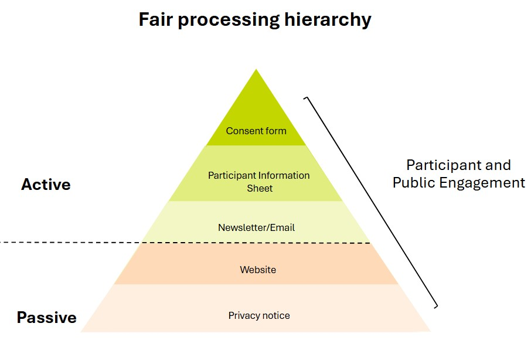

# DO's and DON'Ts
>Last modified: 07 May 2025

This section covers: the DO’s and DONT’s when developing active communication materials, what fair processing is, why you need to conduct it and the different fair processing communication methods.

#### DO’s and DON'Ts when developing active communication materials

Consent statements and fair processing materials should be carefully phrased, taking into account literature on consenting behaviours and avoiding imposing unintentional limitations on data use. Consent phrasing should make clear the understanding and agreement on the high-level principles involved, whereas information materials can provide detail and exemplar illustrations. 

Expectations of good practice in consent will change over time. Therefore, any development process should start with evaluating guidance and academic literature and then consulting with domain experts, data owners and LPS participants. The co-design of materials with participants and members of the public is a critical element of the process. 

There is a significant amount of supporting documentation you will need to have in place, some of which may already be in place, although it may need to be updated to reflect the new sources of data. This will include an LPS protocol, [HRA protocol](https://www.hra.nhs.uk/planning-and-improving-research/research-planning/protocol/), an LPS privacy notice a data asset register and a data flow diagram. 

  

    

    <strong>Key messages that MUST be included in LPS active communications</strong>
    

  
 

| Concept                      | Principle to Convey (top layer)                                                                 | Potential Supporting Narrative                                                                                                                                                                                                                     |
|------------------------------|------------------------------------------------------------------------------------------------|-----------------------------------------------------------------------------------------------------------------------------------------------------------------------------------------------------------------------------------------------------|
| Research Purpose             | Scope of research or that UK LLC supports legitimate research for any public good research.     | • That UK LLC supports research for any public good.   • That the LPS retain control over which participants’ records are used, who can use the data, and for which purpose.                                                                 |
| Record Linkage               | (1) Participants’ health, socio-economic, and environmental records are linked to LPS survey data.   (2) Participant identifiers are shared with the NHS and UK Statistical Authorities to achieve this purpose.   (3) Participant address data are geo-coded to enable place-based data linkage. | • UK LLC is a mechanism by which the LPS implements its record linkage strategy.   • UK LLC provides a centralised mechanism which provides added security, is cost-efficient, and enables new scientific possibilities and improved research equity.   • Participants’ identifiers are only shared with the same NHS and Statistical Authorities that the LPS would use directly.   • All data in the UK LLC is de-identified and subject to Five Safe’s governance principles.   • The data stay in the UK LLC Trusted Research Environment at all times and only anonymous findings can leave the UK LLC environment. |
| Researchers accessing data   | That (accredited) researchers beyond the LPS will access data (within the TRE).                 | • That the LPS retains control over which participants’ records are used, who can use the data, and for which purpose.   • UK LLC provides a secure mechanism for the LPS to share de-identified data with approved researchers under contract and subject to controlled and audited conditions. |
| Right to Object              | Participants are free to change their minds and object to data being shared with UK LLC (or more generally). | • The right to object is always respected, and a mechanism exists to stop the record linkage process and all new use of participants’ data.   • For Section 251 LPS studies, UK LLC respects the National Data Opt Out and no data is linked where participants have set a National Data Opt Out request. |
| Types of data to be linked to | Linkage to data type(s): health records, administrative data [relevant examples as appropriate]. | • This could include…..   • Such as……   [Avoid detailing exhaustive lists of data types, as this can become problematic in the future.]                                                                                                      |

*Include information on environmental data linkage where LPS have a postcode or address sharing permissions in place. 

  

    

    <strong>Health Research Authority guidance for Participant Information Sheets (PIS)</strong>
    

  

In the summary PIS

The Health Research Authority (HRA) recommend that potential participants are provided with a summary sheet that provides a simple outline of the study. They suggest that if you use such a summary, the text about use of personal data should be kept brief and simple.

>In this research study we will use information from [you] [your medical records] [your GP] [OTHER]. We will only use information that we need for the research study. We will let very few people know your name or contact details, and only if they really need it for this study. **(UK LLC recommends providing an overview of the types of records and examples rather than an extensive or exclusive list of records to enable linkages that may become available.)**
>
>Everyone involved in this study will keep your data safe and secure. We will also follow all privacy rules. 
>
>At the end of the study we will save some of the data [in case we need to check it] AND/OR [for future research]. 
>
>We will make sure no-one can work out who you are from the reports we write.
>
>The information pack tells you more about this.

In the PIS or document provided to participants:

>How will we use information about you?
>
>We will need to use information from [you] [from your medical records] [your GP] [OTHER] for this research project. **(UK LLC recommends providing an overview of the types of records and examples rather than an extensive or exclusive list of records to enable linkages that may become available).**
>
>This information will include your [initials/ NHS number/ name/ contact details/ **provide a bullet list of identifiers held by site and/or sponsor for the research**]. People will use this information to do the research or to check your records to make sure that the research is being done properly.
>
>**OPTION where applicable:** People who do not need to know who you are will not be able to see your name or contact details. Your data will have a code number instead.
>
>**OPTION if not already stated: [insert name of sponsor]** is the sponsor of this research. *(A sponsor is the organisation or partnership that takes on overall responsibility for arrangements being in place to set up, run and report a research project.)*
>
>**[insert name of sponsor]** is responsible for looking after your information. We will share your information related to this research project with the following types of organisations:
> - **[in bullet points, list the organisation types]**
> We will keep all information about you safe and secure by:
>**in bullet points, concisely list some of the steps you will take to keep information secure**

How will we use information about you after the study ends?

>
>Once we have finished the study, we will keep some of the data so we can check the results. We will write our reports in a way that no-one can work out that you took part in the study.
>
>**Option 1 where data is stored for a set number of years:** We will keep your study data for a maximum of [insert number] of years. The study data will then be fully anonymised and securely archived or destroyed. **(UK LLC does not recommend stating a specific set number of years as it limits the number of years in which the retention period is compatible with UK LLC processing LPS data.)**
>
>**Option 2 where conditions determine how long data is stored for:** We will keep your study data for the minimum period of time required by **[state the conditions that will be used to determine this time period]** The study data will then be fully anonymised and securely archived or destroyed. **(As per GDPR, any personal data must not be kept any longer than is necessary for the purpose for which the personal data are processed. However, there is an exemption in the Information Commissioner's Office (ICO) guidance for research data which allows retention indefinitely. We note that both the data held by UK LLC and the documents relating to the design, operations and development of UK LLC all constitute 'research data' and can therefore be held indefinitely. UK LLC recommends not specifying how long an LPS will retain participant data but remaining compliant with GDPR by only retaining the data for as long as needed. For example "As we would like to look at long-term trends in people's health, we have not set a limit on how long we would like to keep your information".)**

What are your choices about how your information is used?

>
>- you can stop being part of the study at any time, without giving a reason, but we will keep information about you that we already have
>- **OPTION if follow up data will be collected after withdrawal:** If you choose to stop taking part in the study, we would like to continue collecting information about your health from [central NHS records / your hospital / your GP]. If you do not want this to happen, tell us and we will stop
>-you have the right to ask us to access, remove, change or delete data we hold about you for the purposes of the study. You can also object to our processing of your data. We might not always be able to do this if it means we cannot use your data to do the research. If so, we will tell you why we cannot do this
>**OPTION if data will be used for future research:** If you agree to take part in this study, you will have the option to take part in future research using your data saved from this study. **[Insert details of any specific bank / repository]**
>
>*For more information visit the [HDR Guidance on GDPR transparency wording](https://www.hra.nhs.uk/planning-and-improving-research/policies-standards-legislation/data-protection-and-information-governance/gdpr-guidance/templates/transparency-wording-for-all-sponsors)*
>

  

    

    <strong>Key messages that MUST be included in LPS active communications if linking to administrative data</strong>
  
 

| Concept                | Principle to Convey (top layer) | Potential Supporting Narrative                                                                                                                                         |
|------------------------|---------------------------------|------------------------------------------------------------------------------------------------------------------------------------------------------------------------|
| Security & Confidentiality | Reassurances                    | • Your de-identified data/information will be linked to records held by the following Government Service Providers [list departments and data types], detail processing pathway.   • HMRC and DWP do not access any participant data – as part of the UK LLC-based research.   • This is not a way in which authorities learn anything new about anyone and will not impact people’s tax or benefits.   • This does not provide a mechanism to access anyone’s bank details. |

  

    

    <strong>Other messages that you may want to include in active communications but must be included in privacy notices/web sources and detailed communications</strong>   
  

  
   

| Concept                  | Principle to Convey (Top Layer) | Potential Supporting Narrative                                                                                                                                                                                                                                                                                                                                 |
|--------------------------|---------------------------------|------------------------------------------------------------------------------------------------------------------------------------------------------------------------------------------------------------------------------------------------------------------------------------------------------------------------------------------------------------------|
| LPS’s continued authority | Restricted use to LPS’s remit   | For each LPS, the use is restricted to the LPS’s remit (e.g., for an LPS who has committed to participants to undertaking cancer research only, then UK LLC can only be used for cancer-related research for that LPS).   That UK LLC is designed to provide a service to the LPS and that the LPS remains fully in control over which participants’ data are used for what purpose. |
| Confidentiality           | Data sharing and de-identification | Participants’ identifiers only will be shared with the NHS and UK statistical authorities to link participants’ information to [health OR other/administrative records].   All data held within the UK LLC is de-identified, this happens by a highly regulated process between government service providers and universities. |
| Review process            | Application review panels       | • All applications to access data are reviewed by:   A panel made up of data owners and data experts to ensure legal requirements are met, and   A panel of public contributors, who assess likely public benefits, clarity of lay materials and advice on the need for project-specific PPIE. |
| Researcher accreditation   | Accreditation and security      | • All researchers accessing data are required to be accredited by the UK Statistics Authority (to ensure statistical competence).   • Linked data is held in a secure Trusted Research Environment which meets the highest Information Security Standards ISO27001 and Digital Economy Act Accreditation. The organisation is audited annually to ensure that it continues to meet these standards. |
| UK LLCs commitments       | Key commitments                 | • UK LLC make a set of key commitments which they promise to abide by (https://ukllc.ac.uk/our-promises) |
| UK LLCs data processing pathway | Privacy policy and data flow diagrams | • For Health (NHS) data and Administrative data (Government Service Providers) can be found in the UK LLC privacy policy [Privacy Notice | UK Longitudinal Linkage Collaboration](https:ukllc.ac.uk/privacy-policy)  • Data flow diagrams can be found in the Data flow section. |

  

    

    <strong>Restrictive statements to avoid</strong>
    

  
   

| Concept                                    | Example                                                                 | Rationale                                                                                                                                                                                                 |
|--------------------------------------------|-------------------------------------------------------------------------|----------------------------------------------------------------------------------------------------------------------------------------------------------------------------------------------------------|
| Statements that restrict the research purpose | ‘Data will only be used e.g. understanding cancer, improving mental health’. | We caution against purpose limitations unless necessary. While an LPS may be initially funded to conduct a single or range of theme (e.g., disease) focused questions, the data typically develop wider utility and public benefit value. Flexibility is important for cases like the COVID-19 pandemic. |
| Statements that restrict data processing (linkage) or storage | ‘Data will only be stored at University x or data will be processed by University x’. | We recommend using broader statements around the level of oversight and limiting names of locations or processors to updatable privacy notices. |
| Statements that restrict Open and FAIR access | ‘Only researchers at university x will be able to access your data’. | Most funders now expect Open and FAIR science, maximizing the value of data by sharing it with legitimate users under secure conditions. Participants generally accept that research expertise and capacity may lie outside the direct LPS team or institution. |
| Statements that restrict the length of the LPS/collaboration | ‘Your data will only be kept for x years’. | Time limitation statements should be avoided since there may be continued scientific/public benefit beyond that date. LPS often continue longer than their initial funding periods, and there’s limited evidence that the public considers these time limits a meaningful safeguard. |

 

#### Why do you need to conduct fair processing? 
LPS must take all reasonable and pragmatic measures to ensure participants have a reasonable expectation of how their data are used - the ‘no surprises’ principle. For this reason, LPS must provide ‘fair processing’ information updates to participants regarding record linkage, the sharing of data with research users, and the role of UK LLC in these processes. 

  <strong>Fair Processing:</strong> processing personal data must always be fair as well as lawful, you should only handle personal data in ways that people would reasonably expect.

 
The Information Commissioner’s Office recommends a layered approach to providing information - e.g. with a high-level summary (e.g. cover letter, infographic) then a detailed summary leaflet and signposting or providing a source of more detail (e.g. privacy notice/web source for participants who want to understand the detail). Key messages should be reinforced over time preferably through annual active communications.

#### What should your fair processing cover? 

**UK LLC fair processing must make clear:** 

* The scope of the research purpose that LPS data can be used for. Ideally LPS data are used for a range of research purposes (which could extend from including any public good research to being limited to a specific hypothesis or theme of research). 

* A national Trusted Research Environment(s) is used to enable this linkage in a secure manner (named UK Longitudinal Linkage Collaboration) along with the NHS and national statistics agencies whose role it is to provide access to participants’ records for research purposes. 

* Approved research users, beyond your LPS study team, can apply to access de-identified data within the TRE. 

* That participants have the right to opt-out and to provide details/signpost how to do this. 

#### How should I communicate with participants? 
**Method:**  

* Communications should be made through an ‘active campaign’ i.e. sent by Longitudinal Population Studies (LPS) to all participants, this could be through newsletters or letters sent either electronically or mailed out to all participants which must provide a means to object (LPS may choose to seek specific opt-in consent).  

* The privacy notices are an opportunity to provide very detailed information for participants (and other stakeholders) who wish to understand this level of detail. UK GDPR requires LPS to issue privacy notices providing fair processing. It should be stressed that while all materials and other communications with participants constitute fair processing, there is a separate need to provide a privacy notice. The Information Commissioner's Office (ICO) has produced [guidance](https://ico.org.uk/for-organisations/advice-for-small-organisations/how-to-write-a-privacy-notice-and-what-goes-in-it/) describing what information should be included. Updates can be provided via social media channels and this is particularly effective at alerting participants to change and promoting new research use and outcomes.  

* LPS should consider equality/accessibility when determining whether to use electronic and postal mechanisms and while an electronic-only approach may be suitable in some LPS, for most a choice of physical media (ie, postal materials) and electronic media should be offered.  

* Reasonable adjustments should be made to accommodate participants' specific needs (e.g., large print media or audio versions). 

**Language:**

* You should use the language that is suited to your LPS and your sample. There is no fixed wording however examples can be found under [UK LLC’s templates](/Key%20messages%20in%20active%20communications.md).

* Existing information should be up to date (e.g. privacy notices), and participant information sheets should reflect any changes. New stories should be added to existing media - e.g. website updates, social media, newsflashes or blogs should be updated where possible to alert participants to changes and to keep ‘consent’ a live topic.

#### Do I need public/participant involvement? 

Data Owners and regulators are increasingly   insisting that LPS include participants and public contributors in understanding what is needed to help ensure there are ‘no surprises’ around data use and to co-develop fair processing materials. LPS using Section 251 must involve participants and/or the public – including gaining feedback on the acceptability of the collaboration with UK LLC, whether existing fair processing is sufficient and co-developing new fair processing – to gain/maintain Health Research Authority (HRA)[ Confidentiality Advisory Group (CAG)](https://www.hra.nhs.uk/about-us/committees-and-services/confidentiality-advisory-group/#:~:text=The%20Confidentiality%20Advisory%20Group%20%28CAG%29%20is%20an%20independent,the%20Health%20Research%20Authority%20%28HRA%29%20for%20research%20uses.) approval. 

Where an LPS has gained  approval to use identifiable data without consent under 'Section 251’ provisions and following review by the Health Research Authority’s Confidentiality Advisory Group then it is considered essential (as a requirement of the HRA CAG) that the fair processing materials and communication methods are co-developed by LPS Patient and Public Involvement and Engagement (PPIE) groups. 

If it is not possible to consult LPS-specific PPIE groups, please contact  info@ukllc.ac.uk to discuss.

>[FAQs](https://ukllc.ac.uk/faq) about UK LLC
