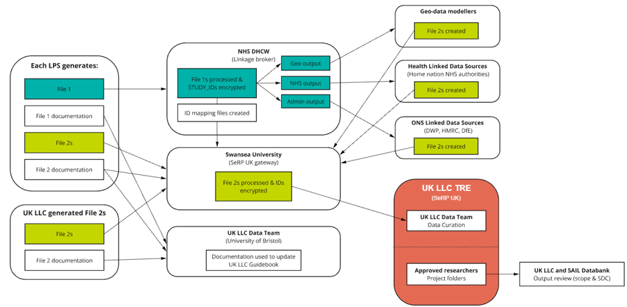

# Research Ethics Committee (REC) Guidance
>Last modified: 12 Aug 2026

This section provides guidance and information on updating your Research Ethics Committee (REC) approval for working with UK LLC as a partner study. It also provides suggested text to use in an amendment.

#### Introduction: 
Ethics can be local or via the Health Research Authority (HRA). You will also need to update your HRA REC to include UK LLC and the 3rd party data processors, making the relationship, linkage and provision (to UK-wide researchers), clear in the update. 

UK LLC will require your ethics board's approval before you are able to partner with us for linkage.

[Research Ethics Committees (RECs)](https://www.hra.nhs.uk/about-us/committees-and-services/res-and-recs/research-ethics-committees-overview/) review research applications and give an opinion about whether the research is ethical. They look at areas such as the proposed participant involvement and are entirely independent of research sponsors (that is, the organisations which are responsible for the management and conduct of the research), funders and investigators. This enables them to put participants at the centre of their review. 

For most applicants to the Health Research Authority (HRA), the REC review forms part of the overall [HRA Approval process](https://www.hra.nhs.uk/approvals-amendments/what-approvals-do-i-need/hra-approval/). For some projects that do not require HRA Approval, such as [research tissue banks and research databases](https://www.hra.nhs.uk/planning-and-improving-research/policies-standards-legislation/research-tissue-banks-and-research-databases/), or [research taking place outside the NHS](https://www.hra.nhs.uk/approvals-amendments/what-approvals-do-i-need/research-ethics-committee-review/non-nhs-research-projects/) such as [Phase 1 trials in healthy volunteers](https://www.hra.nhs.uk/planning-and-improving-research/policies-standards-legislation/phase-1-clinical-trials/), REC review may still be required. [From HRA – Research Ethics Committee Review](https://www.hra.nhs.uk/approvals-amendments/what-approvals-do-i-need/research-ethics-committee-review/).

#### What to include in your amendment: 

[Please amend text in yellow to suit your specific study.]

1.	UK LLC widening research purpose

**Briefly summarise in lay language the main changes proposed in this amendment:**  

Widening the scope of the UK Longitudinal Linkage Collaboration (UK LLC): The UK LLC was created in 2020 to facilitate access to survey data collected in the UK’s longitudinal studies alongside linked health records in order to support priority research on the impacts of the COVID-19 pandemic. UK LLC has now widened its research scope to make data available, within its Trusted Research Environment, for any public good research. 

**Further information:**

On the <mark>[Insert Date]</mark>, <mark>[Study name]</mark> obtained REC approval to become a member of the UK Longitudinal Linkage Collaboration, which was established in 2020 to facilitate access to survey data collected in the UK’s longitudinal studies alongside linked health records in order to support priority research on the impacts of the COVID-19 pandemic. UK LLC now has ethical approval, as well as further funding (from the Economic and Social Research Council and the Medical Research Council) to continue to provide linked data for research and to widen its scope to make data available, within its Trusted Research Environment, for any public good research. For this purpose, <mark>[Study name]</mark> will continue send details of participants who have consented to health records linkage to Digital Health Care Wales (DHCW), the Trusted Third Party facilitating health record data linkage on behalf of the UK LLC. Further information about the data linkage process is available on the dataflow diagram provided with this application. Information about UK LLC is included in study newsletters and on study member websites.

2. Text that could be used in a REC amendment

A request to join the UK Longitudinal Linkage Collaboration (UK LLC, NHS Haydock Committee; IRAS: 363066, REC ref: 25/NW/0314), by providing de-identified <mark>[x]</mark> data into a Trusted Research Environment managed by the UK LLC at the University of Bristol. The UK LLC is a national initiative initially funded by the HM Treasury. Recently it was funded for a further 5 years by UKRI, to support longitudinal research by collating information from cohort studies across the UK, including research study data and electronic health records. <mark>[Study name]</mark> would join the UK LLC by depositing relevant de-identified study data from the <mark>[x]</mark> research database into the University of Bristol’s Trusted Research Environment (hosted by the University of Swansea, Data Processor, comprising a UKSeRP model (UK Secure e-Research Platform), ISO27001 accredited). This information will be sent alongside a study ID in order to enable future linkages. 

It is at the discretion of <mark>[x study]</mark> to decide what data to deposit, and data will be deposited on a project-by-project basis. These data transfers will be governed by a Data Deposit Contract between the University of <mark>[X]</mark> (Data Owners) and the University of Bristol (Data Controllers). 

In a separate transfer, the <mark>[x study]</mark> admin team will send participant identifiers to Digital Health and Care Wales (DHCW) to facilitate the linkage of electronic health records. This data will be linked through the NHS’ trusted partners, and relevant de-identified data (linked with study ID) from these NHS partners will be securely transferred back to the UKSeRP where the study ID will be encrypted, and this data deposited into the UK LLC Trusted Research Environment.

Figure 1: Overview of UK LLC data flow.

All data requests to the UK LLC that involve <mark>[x study]</mark> data will be reviewed the <mark>[Name of group]</mark>. Any data shared with researchers will be re-encrypted and in de-identified form and only accessed within the UK LLC TRE. All outputs from the TRE are checked for disclosure risk and will be population level statistical information. For data held in the UK LLC, consent status and data refreshes take place on a quarterly basis, with removals conducted at these times. The UK LLC staff will implement any changes of status and will make the data of objecting participants unavailable in the main integrated data repository. De-identified data that has already been shared with researchers cannot be recalled regardless of change of consent status (as is standard with research studies), and archive copies of all projects that have resulted in published manuscripts will be retained for scientific challenge.

**Justification:**
Through working with UK Longitudinal Linkage Collaboration (UK LLC) as a Data Processor, <mark>[X]</mark> data can be used in combination with data from other UK cohort studies to gain a more in depth understanding of health in the UK. This novel and heterogenous pooled sample provides a unique opportunity for cross-cohort analyses to examine health outcomes across different ages, groups and times. This collaboration will enhance the research value and use of <mark>[study]</mark> as a scientific resource, and not being part of the UK LLC will slow this work. Researchers will only be approved to access UK LLC data if their proposed research is in the public interest. 

