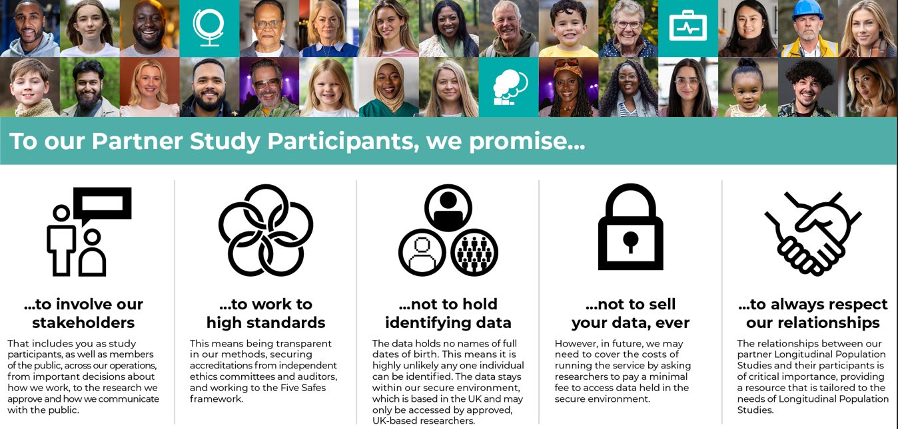

# Introduction
>Last modified: 15 Sep 2026

We thank all the Longitudinal Population Study (LPS) teams, data owners and regulators for all their contributions to the Resource Hub. We fully acknowledge the existing body of good practice and expertise in the participants' community within LPS. These materials are based on the community’s collective efforts and expertise, and are intended for anyone in the LPS community.

#### How to use the Resource Hub:
<aside class="admonition note">

Resource Hub

Resource Hub is a guidance library containing materials to support research governance and to aid communications with participants and the public. It is designed to be relevant to LPS, with some material more relevant to our current or future partner studies.

</aside>

  1. Background information to aid understanding of legal basis.
  2. Good practice, Myths and Misconceptions.
  3. UK LLC’s downloadable communication materials.
  4. UK LLC’s templates to develop your own communications (newsletters, privacy notices, website updates).
  5. UK LLC data processing information (data flow diagrams and designing consent materials).
  6. Updating your ethics.
  7. Health Research Authority (HRA) Confidentiality Advisory Group (CAG): Guidance for longitudinal studies working with UK LLC.

#### Why this guidance is useful: 

* UK LLC believes in the principle of “no surprises” - where participants are provided with the information they need to understand how their study uses their data, including the role UK LLC plays. This is an important part of our commitments to Participants and the Public, and forms part of “our promises".

* By law, LPS must make clear to their participants their collaboration with UK LLC. In a legal context, these communications establish “reasonable expectation” amongst participants as to how their data are used, what rights the participants have and how they can be exercised, particularly the right to object. This guidance will help you develop communications so that your participants can establish an understanding of what is happening and why. 

* These communications can be challenging to write as they need to be accessible to a wide range of the public and also include key statements which meet data owners' (e.g. the NHS) and regulatory (e.g. Information Commissioner’s Office, Health Research Authority) requirements. 

* This guidance will help you consider statements which are restrictive (e.g. setting a limit to the scientific purpose of the LPS, or a time limit for the LPS). Restrictive statements can create future barriers to potential LPS activity and public benefit outcomes. Many longitudinal LPS have evolved in both scope and duration since they were conceived and first established. 
#### What are the limitations of this guidance? 

The following important limitations apply: 

* We appreciate that LPS may have previously communicated with their participants about some of these key messages, so may not need to include all of them in their communications. 

* We cannot guarantee that the guidance provided here will result in fair processing that is either future proof or legally compliant. Best practice and data owner/regulator requirements are constantly evolving, and fair processing will need to adapt to and track change.  

* Failure to adhere to key points set out in this document may mean the LPS inclusion in UK LLC or the set-up of some or all linkages is not possible. 

UK LLC is very happy to review draft materials (send to <a href="mailto: info@ukllc.ac.uk">info@ukllc.ac.uk</a>). We strongly recommend that the content and method of communications should be developed in collaboration with your Patient and Public Involvement and Engagement (PPIE) representatives or via other means of public co-development. 
#### Where can I find further guidance? 

* The Health Research Authority (HRA) have developed [detailed guidance](https://www.myresearchproject.org.uk/help/hlphraapproval.aspx) for using the [Integrated Research Application System (IRAS)](https://myresearchproject.org.uk/crirasguide/gettingstarted.html) which is a single system for applying for the permissions and approvals for health and social care/community care research in the UK. It captures the information needed for the relevant approvals from many review bodies including: 
 
    - Confidentiality Advisory Group (CAG) 

    - NHS/HSC Research Ethics Committees 

    - The Medical Research Council can provide support via the [MRC Centre for Research Policy - UKRI](https://www.ukri.org/councils/mrc/facilities-and-resources/find-an-mrc-facility-or-resource/mrc-centre-for-research-policy/). They have developed specific guidance materials on [Identifiability, anonymisation and pseudonymisation](https://www.ukri.org/publications/gdpr-best-practice-for-keeping-data-anonymous/) and [Consent and Participant Information Guidance](http://www.hra-decisiontools.org.uk/consent/). 

* You will need to register for the [NHS Data Security and Protection Toolkit (DSPT) Toolkit](https://www.dsptoolkit.nhs.uk/). It is recommended that you contact your host organisation’s Information Governance department in the first instance because it is likely they will have an NHS DSPT already and you will probably find that you share a significant proportion of their facilities, particularly IT, cyber-security and infrastructure. 

* The application to NHS England for the health records is done via their DARS and comprehensive guidance is available at [Data Access Request Service (DARS)](https://digital.nhs.uk/services/data-access-request-service-dars/guidance-to-support-your-dars-application) - NHS England. Security assurances for confidential patient information generated within Wales are provided by either a Caldicott Principles in Practice (CPiP) Report or a completed [Welsh Information Governance Toolkit](https://dhcw.nhs.wales/ig/information-governance/welsh-information-governance-toolkit/). An approval letter from the [Public Benefit and Privacy Panel (PBPP)](https://www.informationgovernance.scot.nhs.uk/pbpphsc/), where processing is taking place in Scotland, is accepted as evidence of adequate security assurance for organisations in Scotland. 

 * [Understanding patient data](https://understandingpatientdata.org.uk/) provides guidance and examples of communication materials. This site is closely aligned to the NHS Data Guardian and is therefore considered gold standard by NHS England. 

 
> [FAQs](https://ukllc.ac.uk/faq) about UK LLC

 
